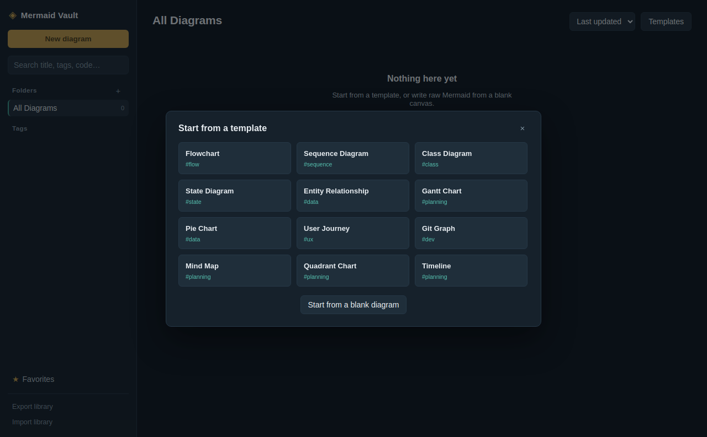
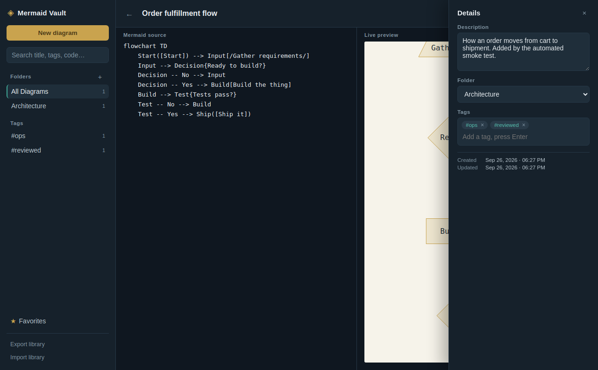
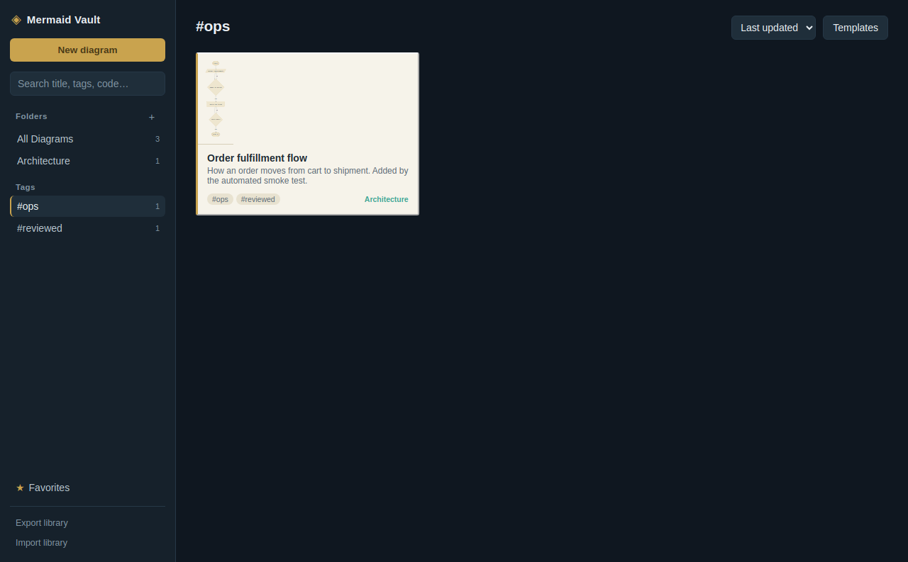

# Mermaid Vault

A local-first personal library for [Mermaid](https://mermaid.js.org) diagrams, built for Linux desktops. Write raw Mermaid, watch it render live, organize it into folders and tags, and export to PNG, SVG, or PDF — all offline, no account, no server.

This exists because there wasn't a Linux desktop app that combined a raw-Mermaid-first editor with real library organization (folders, tags, per-diagram descriptions) and built-in templates — see the feature list and screenshots below.



## Features

- **Raw Mermaid in, live diagram out.** A split view: your Mermaid source on the left, a debounced live render on the right. Parse errors show inline without blanking your last good render. The preview supports full pan (click-drag) and zoom (scroll wheel or the +/−/fit controls), so working with large diagrams is actually comfortable.
- **Visual editor, bidirectional.** For flowcharts specifically, a "Visual" tab next to "Source" lets you build the diagram by clicking: double-click empty space to add a node, drag a node's teal handle to another node to connect them, double-click to rename, pick shapes/connector styles from the inspector bar. Every edit regenerates clean Mermaid text instantly, and opening Visual mode on existing flowchart code parses it back into nodes and edges (auto-arranging anything without a stored layout, while preserving positions you've already set). Diagrams using subgraphs, styling, or other diagram types show a plain explanation instead of silently mangling what they don't yet support.
- **Folders and tags.** Organize diagrams into folders from the sidebar; tag them freely; filter by folder, tag, or favorite; full-text search across title, description, tags, and the Mermaid source itself.
- **Title, description, metadata.** Every diagram has a title, a free-text description, tags, a folder, favorite status, and created/updated timestamps.
- **12 built-in templates** — flowchart, sequence, class, state, ER, Gantt, pie, user journey, git graph, mind map, quadrant chart, timeline — or start from a blank canvas with entirely custom Mermaid.
- **Export to PNG, SVG, or PDF**, all rendered at export time from the live diagram (PNG at 2x resolution for crisp hi-DPI output).
- **Fully offline.** Mermaid's renderer is vendored into the app (`src/vendor/mermaid.min.js`) — no CDN, no network calls (the page's Content-Security-Policy sets `connect-src 'none'`). Your library is a single JSON file on disk (shown by folder in your OS's app-data directory), so it's trivial to back up, sync, or inspect by hand. Library export/import is also built in for backups.





## Install / build

There's no signed release yet — build it yourself, it takes under a minute:

```bash
git clone <this-repo-url>
cd mermaid-vault
npm install
npm start                 # run it directly, for development
```

To produce a real Linux package:

```bash
npm run dist:linux        # writes .AppImage and .deb to release/
```

If `npm start` complains about the sandbox in a container or minimal Linux install without the usual desktop sandboxing bits set up, use:

```bash
npm run start:sandbox-off
```

### Requirements

Node.js 18+ and npm. That's it — Mermaid, Electron, and electron-builder are all pulled in by `npm install`, and the app itself has zero native (compiled) dependencies, which is what makes the AppImage/deb portable across distros.

## How it's organized

```
main.js            Electron main process: window, IPC, file I/O, PNG/PDF export
preload.js         contextBridge — the only API surface the page can reach
src/
  index.html       App shell
  styles.css       Design system (see "Design" below)
  renderer.js       All UI logic: state, CRUD, search/filter, export, pan/zoom, visual-editor wiring
  templates.js      The 12 built-in Mermaid templates
  flowgraph.js      Pure-logic flowchart <-> Mermaid text parser/generator + auto-layout (unit-testable in plain Node, no DOM)
  visual-editor.js  The interactive SVG node/edge canvas for the Visual tab
  vendor/
    mermaid.min.js  Mermaid's UMD build, vendored for fully-offline use
scripts/
  smoke-test.js     End-to-end test runner (see "Testing")
  render-icon.js    Regenerates build/icon.png from build/icon.svg via Electron itself
```

**Storage** is a single `library.json` under Electron's standard `userData` path (e.g. `~/.config/Mermaid Vault/library.json` on Linux) — written via a temp-file-then-rename so a crash mid-write can't corrupt your library. No database engine, no native compile step per platform.

**PNG and PDF export** don't use `<canvas>` — Mermaid's flowcharts render text via `<foreignObject>` HTML, which taints a 2D canvas on export (a Chromium security restriction). Instead, both exports lay the SVG out in a hidden `BrowserWindow` sized to the target resolution and capture the compositor output directly (`webContents.capturePage()` for PNG, `webContents.printToPDF()` for PDF). This also sidesteps Mermaid's inline `max-width` style that it adds for responsive embedding — the export stylesheet overrides it with `!important` so PNG exports actually render at full requested resolution rather than being silently capped.

### Design

The visual language is deliberately not another dark-mode SaaS clone: it's built around a "captain's chart room" idea — Mermaid source stays in the dark, the rendered diagram lives on a pale paper-toned surface so it reads instantly, and brass/teal accents nod to instrument dials and chart ink. Tokens are in `src/styles.css` if you want to reskin it.

## Testing

`npm run smoke-test` launches the actual app (via Xvfb if there's no display) and drives the real UI — not a mock: it clicks through the template gallery, fills in title/description/tags/folder, favorites a diagram, pans and zooms the live preview, switches to the Visual tab and confirms the flowchart parsed correctly, adds a node by double-click, connects it to an existing node by dragging, confirms the Mermaid source regenerated correctly, exports PNG/SVG/PDF, verifies each exported file's binary signature, adds more diagrams, and filters by tag — then writes screenshots and the exported files to a temp directory so a build can be verified without a human at the keyboard. This exact harness is what caught, during development, a duplicate-folder bug, a stale-sidebar-count bug, the canvas/max-width export bugs described above, an auto-layout algorithm that stalled completely on any cyclic flowchart (i.e. any diagram with a retry/validation loop), and a missing rename prompt when adding a node visually.

`flowgraph.js` (the Mermaid <-> graph-model converter) has no DOM dependency, so its parser/generator round-trip can also be exercised directly in plain Node — see the inline comments for example invocations.

## Roadmap ideas

Nested folders, a Kroki/mermaid-cli fallback renderer for very large diagrams, per-diagram version history, and a command palette. PRs welcome.

## License

MIT — see [`LICENSE`](LICENSE).
